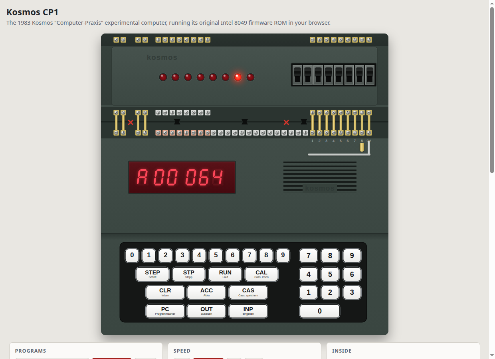

# Kosmos CP1 — browser emulator

**Run it: <https://lambdamikel.github.io/kosmos-cp1-emulator/>**

A JavaScript-only emulator of the 1983 Kosmos CP1 "Computer-Praxis" experimental
computer that runs the **original Intel 8049 firmware ROM**. Static files, no build
step, nothing to install. Sister project of the
[Busch Microtronic 2090 emulator](https://github.com/lambdamikel/microtronic-emulator).

## What is emulated

Nothing in the firmware is patched or intercepted.

- **Intel 8049** (`js/cp1.js`): all instructions, both register banks, the stack, the
  timer and its interrupt (which drives the firmware's display and keypad scan).
- **Two Intel 8155** RAM/IO chips: the one in the main unit (program cells 000–127,
  display, keypad, Port 2) and the one of the memory expansion (cells 128–255, Port 4).
- **Display** (six multiplexed 7-segment digits) and **keypad**.
- **Port 1** (inputs): eight switches, plus the manual's ground rail and contact clips
  (section 1.53) as push buttons on any line.
- **Port 2** (outputs): eight LEDs.
- **Random-number wiring** (manual Bild 65): Port 2 wired back to Port 1 with the lines
  shuffled; the mapping can be edited.
- **Sound**: a tone generator on Port 4, and the manual's melody-generator wiring with
  one tone per Port 2 line (c d e f g a h c).

At the original clock (6 MHz crystal, 400,000 machine cycles/s) the timing is that of
the machine. Not emulated: the cassette interface (CAS / CAL), ports 3 and 5, and any
of the manual's add-on circuits beyond the above.

The pitch of the Port 4 tone generator (value n = n−1 semitones above middle C) is an
assumption of this emulator; the manual only shows 0 as "off".

## Using it

- Click the keys, or use the PC keyboard: digits, `Enter`/`I` INP, `O` OUT, `P` PC,
  `A` ACC, `R` RUN, `.`/`H` STP, `T` STEP, `X`/`Delete` CLR, `Esc` power off/on,
  `Shift`+`1`…`8` contact clips.
- The library holds 55 programs: new ones (port echo, counter, running light, sound
  demos, a switch piano, recursive Towers of Hanoi) and 48 listings of the Kosmos
  manual, among them the moon landing, Nim, the clock, roulette and the melody
  generator. Loading a program sets up the wiring it needs.
- The manual ([PDF on archive.org](https://archive.org/download/cp-1-manual/CP1-Manual.pdf),
  German) explains each listing.
- Program files: lines like `012 ako 04.200` or `012 04.200`, `#` or `;` comments.
- **Inside** shows program counter, Akku, the ports and a live, editable listing of all
  256 cells.
- Links: `index.html?load=HANOI&speed=4`.

## Files

    index.html, css/cp1.css   page and console
    js/cp1.js                 8049 + 8155s + board (no DOM)
    js/ui.js                  GUI
    js/rom.js                 the 2048-byte firmware ROM, base64
    js/programs.js            program library (tools-build-programs.py, from programs/)
    programs/manual/          manual listings 1-35, 55, 90-93, 100 as transcribed by Andreas Signer
    programs/L0nn.txt, MOON.txt, MELODY40.txt   manual listings read from the scanned manual for this emulator
    test/                     headless-Chrome checks against the ROM
    tools-stamp.sh            run before committing changes to css/ or js/

## Acknowledgements

- **Andreas Signer** — his [kosmos-cp1](https://github.com/asig/kosmos-cp1) emulator
  (GPL-3) is the reference: the 8049 core and the board wiring follow it, and the ROM
  image, its commented disassembly and the transcriptions of manual listings 1–35 and
  55 come from his repository.
- **Franckh-Kosmos** — the CP1, its firmware and its manual are © 1983 Franckh'sche
  Verlagshandlung, W. Keller & Co., Stuttgart.
- Towers of Hanoi: [lambdamikel/towers-of-hanoi](https://github.com/lambdamikel/towers-of-hanoi).
  CP1 assembler and cassette tools: [kosmos-cp1-devel-toolchain](https://github.com/lambdamikel/kosmos-cp1-devel-toolchain).
- Console drawn after the photos at the [8-Bit Homecomputermuseum](http://www.8bit-homecomputermuseum.at/computer/kosmos_computer_praxis_cp1.html).

Made with Claude Opus 5.5 (Claude Code), together with Michael Wessel.

## License

The emulator is licensed under the [GNU General Public License v3](LICENSE).

**Not covered by the GPL:** the CP1 firmware ROM in `js/rom.js` and the programs taken
from the Kosmos manual are © Franckh-Kosmos.
